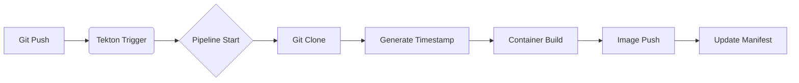

# OCI 기반 프로덕션 레벨 DevSecOps 플랫폼 구축 프로젝트

> **"Infrastructure as Code, GitOps, 그리고 Observability가 완벽하게 통합된 엔터프라이즈급 플랫폼"**

## 📖 1. 프로젝트 개요 (Introduction)

이 프로젝트는 **Oracle Cloud Infrastructure (OCI)** 환경에서 **Kubernetes (OKE)** 기반의 고가용성, 고보안성 마이크로서비스 플랫폼을 구축한 사례입니다.
단순한 기술 스택의 나열이 아니라, **실제 운영 환경(Production)** 에서 발생할 수 있는 보안 위협, 배포 복잡성, 장애 관측의 어려움을 해결하기 위해 **Cloud-Native Computing Foundation (CNCF)** 의 표준 기술들을 유기적으로 통합했습니다.

**핵심 목표:**
*   **Zero-Downtime Deployment**: ArgoCD와 Kustomize를 활용한 무중단 배포 구현.
*   **Security by Design**: 런타임 보안(Falco), 정책 보안(Kyverno), 시크릿 관리(Vault)가 내재화된 플랫폼.
*   **Full-Stack Observability**: 로그, 메트릭, 트레이싱을 통합하여 애플리케이션의 가시성을 100% 확보.

---

## 🏗️ 2. 시스템 아키텍처 (System Architecture)

### 2.1 인프라스트럭처 (Infrastructure on OCI)
모든 인프라는 **Terraform**을 통해 코드(IaC)로 관리됩니다.
*   **Network Layer**:
    *   **VCN (Virtual Cloud Network)**: 퍼블릭/프라이빗 서브넷 분리. 철저한 보안 그룹(NSG) 적용.
    *   **Bastion Host**: 프라이빗 서브넷 접근을 위한 단일 진입점 관리.
*   **Compute Layer (OKE)**:
    *   **Control Plane**: OCI Managed Kubernetes Service.
    *   **Node Pools**: 워크로드 특성에 따른 노드 풀 분리 (General Purpose, High Memory etc.).
    *   **Cluster Autoscaler**: 트래픽 증가에 따른 노드 자동 확장 구성.
    *   **Cost Optimization**: **Managed Node**와 **Virtual Node**를 혼합 사용하여 관리 오버헤드를 줄이면서도 비용 효율적인 클러스터를 운영합니다. 상시 운영되는 워크로드는 Managed Node에, 일시적인 배치 작업이나 스파이크 트래픽 처리는 Virtual Node를 활용하여 비용을 최적화했습니다.

### 2.2 애플리케이션 아키텍처 (Microservices)
이커머스 비즈니스 로직을 처리하기 위해 Frontend와 Backend가 분리되어 있습니다.
*   **Frontend**: React (SPA), Nginx 서빙.
*   **Backend**: Go (Gin Framework), RESTful API.
*   **Data Store**:
    *   **PostgreSQL**: CloudNativePG Operator를 통한 HA 구성 (Primary-Replica).
    *   **Redis**: 세션 관리 및 캐싱.
    *   **MinIO**: S3 호환 오브젝트 스토리지 (이미지 파일 저장).

---

## 🔁 3. CI/CD 파이프라인 (Continuous Integration / Continuous Deployment)

이 프로젝트는 **Tekton** (CI)과 **ArgoCD** (CD)를 결합하여 완전한 GitOps 파이프라인을 구축했습니다.

### 3.1 CI 파이프라인 (Tekton)
개발자가 코드를 푸시하면 Tekton Trigger가 감지하여 파이프라인을 실행합니다.

1.  **Git Clone**: 소스 코드 저장소에서 코드를 가져옵니다.
2.  **Generate Timestamp**: 이미지 태깅을 위한 고유 타임스탬프를 생성합니다.
3.  **Container Build (Kaniko)**: Docker Daemon 없이 보안성이 강화된 환경(Kaniko)에서 컨테이너 이미지를 빌드합니다.
    *   *Caching*: Harbor Registry를 캐시 저장소로 활용하여 빌드 속도 최적화.
4.  **Image Push -> Harbor**: 빌드된 이미지를 Harbor(Private Registry)에 푸시하고, 동시에 Trivy를 통해 **이미지 취약점 스캔**을 수행합니다.
5.  **Update Manifest**: Kustomize 배포 설정 파일(`deploy-kustomize`)의 이미지 태그 버전을 자동으로 업데이트하고 Git 저장소에 다시 푸시합니다.

### 3.2 CD 파이프라인 (ArgoCD)
ArgoCD는 **App of Apps 패턴**을 사용하여 인프라 앱과 비즈니스 앱을 계층적으로 관리합니다.
*   **Sync Automation**: Git 저장소(Manifests)의 변경 사항을 감지하여 3분 이내에 클러스터에 반영합니다.
*   **Self-Healing**: 클러스터 상태가 Git 정의와 달라지면 자동으로 복구합니다.

---

## 🛡️ 4. 보안 및 거버넌스 (Security & Governance)

운영 환경 수준의 강력한 보안 체계를 갖추고 있습니다.

### 4.1 Secret Management (Vault + ESO)
*   **문제**: Git 저장소에 API Key, DB Password 등 민감 정보가 평문으로 노출되는 위험.
*   **해결**: HashiCorp Vault에 암호화하여 저장하고, **External Secrets Operator (ESO)** 를 통해 파드(Pod) 실행 시점에만 메모리 볼륨으로 마운트합니다.
    *   **Secure Deployment**: 배포 파이프라인(CD)이나 Manifest 파일 어디에도 실제 시크릿 값이 포함되지 않습니다. 오직 애플리케이션이 실행될 때 Vault로부터 동적으로 값을 주입받아 완벽한 보안을 유지합니다.
    *   Kubernetes Auth Method를 사용하여 파드의 ServiceAccount 인증.

### 4.2 Policy as Code (Kyverno)
*   **기능**: 클러스터 보안 위반 사항을 사전에 차단, 감지합니다.
*   **적용된 정책**:
    *   `Disallow Root User`: Root 권한으로 실행되는 컨테이너 배포 차단.
    *   `Require Resource Limits`: CPU/Memory 제한이 없는 파드 배포 거부.
    *   `Check Image Vulnerabilities`: 중요(Critical) 취약점이 발견된 이미지 배포 차단.
*   **알림**: 정책 위반 시 Slack 채널로 실시간 경고 발송.

### 4.3 Runtime Security (Falco)
*   커널 레벨(eBPF)에서 시스템 콜을 감시하여 비정상 행위(예: 쉘 접속, 민감한 파일 접근)를 실시간으로 탐지합니다.

---

## 👁️ 5. 관측성 (Observability - LGTM Stack)

Grafana 생태계의 도구들을 통합하여 **LGTM (Loki, Grafana, Tempo, Mimir)** 스택을 구축했습니다.

| 컴포넌트 | 역할 | 상세 내용 |
| --- | --- | --- |
| **Loki** | 로그 수집 | Promtail 에이전트가 노드별 로그 수집. 레이블 기반의 고성능 로그 쿼리 지원. |
| **Grafana** | 시각화 | 모든 메트릭(인프라, 앱, 비즈니스) 및 로그/트레이싱 데이터를 단일 대시보드에서 통합 뷰 제공. |
| **Tempo** | 트레이싱 | 마이크로서비스 간의 요청 흐름(Trace ID)을 추적하여 병목 구간 식별. |
| **Mimir** | 메트릭 저장 | Prometheus의 장기 스토리지 역할. 메트릭 데이터의 고가용성 및 멀티 테넌시 지원. |
| **Uptime Kuma** | 가용성 | 외부에서 서비스 접근 가능 여부를 지속적으로 체크하고 상태 페이지 제공. |

---

---

## ⚙️ 6. 운영 최적화 및 개발 편의성 (Operational Excellence)

인프라를 구축하는 것을 넘어, **지속 가능한 운영**과 **개발자 생산성 향상**을 위한 도구들을 도입했습니다.

### 6.1 Cluster High Availability (Descheduler)
*   **문제**: 클러스터 운영 기간이 길어질수록, 특정 노드에 파드가 몰리거나 리소스 활용 불균형이 발생.
*   **해결**: **Kubernetes Descheduler**를 도입하여 주기적으로 정책(Policy)을 실행합니다.
    *   `RemoveDuplicates`: 동일 노드에 중복 배포된 파드를 분산.
    *   `LowNodeUtilization`: 리소스 사용률이 낮은 노드를 찾아 파드를 재배치(Rebalancing).
    *   이를 통해 **노드 리소스 효율성을 극대화**하고 특정 노드 장애 시 영향도를 최소화합니다.

### 6.2 Developer Experience (Automated Bastion Access)
*   **문제**: 보안을 위해 Private Subnet에 위치한 OKE 클러스터 및 DB에 접근하기 위해 복잡한 터널링 명령어가 필요.
*   **해결**: OCI Python SDK를 활용한 **자동화 스크립트 (`bastion_connection.sh`)** 개발.
    *   단 한 줄의 명령어로 세션 생성, MFA 인증, SSH 터널링, 로컬 포트 포워딩까지 **All-in-One 자동화**.
    *   `infra/bastion_connection.sh`를 통해 동료 개발자들이 손쉽게 프로덕션 DB 및 내부망에 접근 가능하도록 지원.

---

## 📂 7. 디렉토리 구조 상세 (Directory Structure)

### `infra/`
Kubernetes 기반 인프라 애플리케이션의 Helm Chart 및 Manifest 모음입니다.
*   `argocd/`: GitOps 엔진.
*   `cert-manager/`: SSL/TLS 인증서 자동 관리 (LetsEncrypt).
*   `ingress_route/`: Traefik IngressRoute 설정 (L7 로드밸런싱).
*   `vault/`: 시크릿 관리 저장소.

### `build-pipelines/` (Tekton)
*   `tekton/ecommerce-backend/`: 백엔드 빌드 파이프라인.
    *   `helm/templates/trigger-template.yaml`: GitHub Webhook 페이로드 파싱.
    *   `helm/templates/pipeline-system.yaml`: 스텝별 실행 순서 정의.

### `deploy-kustomize/`
환경별(Dev, Prod 등) 설정을 오버레이(Overlay) 방식으로 관리합니다.
*   `base/`: 공통 리소스 정의 (Deployment, Service 등).
*   `overlays/dev/`: 개발 환경 전용 패치 (Replica 수, CPU/Memory Limit 등).

---

## 🚀 8. 기술적 차별점 (Technical Highlights)

이 프로젝트에서 중점적으로 구현한 기술적 특징들은 다음과 같습니다.
1.  **Platform Engineering**: 개발자가 비즈니스 로직에만 집중할 수 있도록 셀프 서비스 가능한 인프라 환경 구축.
2.  **Advanced Kubernetes**: Custom Resource Definition (CRD), Operator 패턴, Admission Controller의 적극적인 활용.
3.  **DevSecOps**: 보안이 "나중에 추가되는 것"이 아니라 파이프라인 초기 단계부터 통합된(Shift-Left) 환경 구현.
4.  **Troubleshooting**: 분산 환경에서의 복잡한 문제를 추적하고 해결할 수 있는 관측성 시스템 설계.

---

## 📧 Contact
*   **Name**: [성함 입력]
*   **Email**: [이메일 입력]
*   **LinkedIn/Blog**: [링크 입력]
