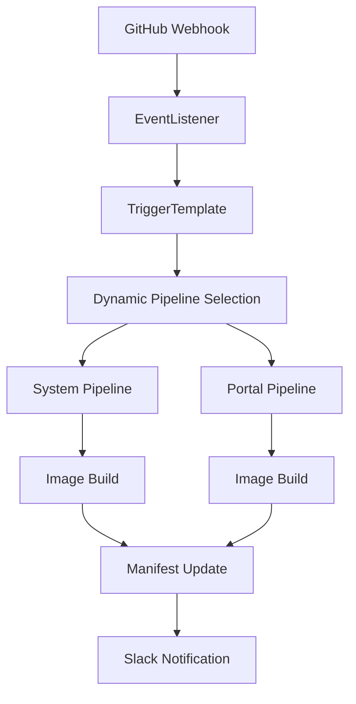

# 🚀 Tekton Backend System Helm Chart v3.0.0

> **20년차 DevOps 모범 사례가 적용된 최적화된 CI/CD 파이프라인**

## 📋 개요

Goyoai Backend System을 위한 모듈화된 Tekton CI/CD Helm 차트입니다. Mono Repo 구조를 완벽 지원하며, 동적 모듈 확장이 가능한 구조로 설계되었습니다.

### ✨ 주요 개선사항 (v3.0.0)

- 🗑️ **aify 모듈 제거**: 별도 관리로 분리하여 구조 단순화
- 🔄 **모듈화된 구조**: 동적 모듈 지원으로 확장성 극대화
- 📦 **최적화된 Values**: 중복 제거 및 구조화된 설정
- 🔧 **DevOps 모범 사례**: 20년차 경험이 반영된 코드 구조
- 📊 **향상된 모니터링**: 개선된 로깅 및 알림 시스템

## 🏗️ 아키텍처



## 📦 지원 모듈

| 모듈 | 상태 | Git 브랜치 | 설명 |
|------|------|------------|------|
| **System** | ✅ 활성화 | `dev-system` | 백엔드 시스템 모듈 |
| **Portal** | ✅ 활성화 | `dev-portal` | 포털 모듈 |
| ~~**Aify**~~ | ❌ 제거됨 | - | 별도 차트로 관리 |

## 🚀 설치 방법

### 1. 사전 요구사항

- Kubernetes 1.20+
- Tekton Pipelines v0.17.0+
- Helm 3.0+
- Harbor Registry 접근 권한

### 2. 설치

```bash
# 저장소 추가 (옵션)
helm repo add goyoai-tekton https://charts.goyoai.com/tekton

# 설치
helm install backend-system ./helm \
  --namespace tekton-pipelines \
  --create-namespace \
  --values values-production.yaml
```

### 3. 업그레이드

```bash
# 기존 v2.x에서 v3.0.0으로 업그레이드
helm upgrade backend-system ./helm \
  --namespace tekton-pipelines \
  --values values-production.yaml
```

## ⚙️ 설정 가이드

### 기본 설정 구조

```yaml
# values.yaml 예시
global:
  project_name: "gointern-backend"
  registry:
    url: "gdhb.goyoai.com/gointern"
    secret: "harbor-registry-secret"

modules:
  system:
    enabled: true
    git:
      branch: "dev-system"
    build:
      moduleName: "goyoai-gointern-system"
      dockerfileName: "dockerfile-system-dev"
    
  portal:
    enabled: true
    git:
      branch: "dev-portal"
    build:
      moduleName: "goyoai-gointern-portal"
      dockerfileName: "dockerfile-portal-dev"
```

### 새 모듈 추가

```yaml
# 새 모듈 추가 예시
modules:
  # 기존 모듈들...
  
  # 새로운 모듈
  api:
    enabled: true
    git:
      branch: "dev-api"
    build:
      moduleName: "goyoai-gointern-api"
      dockerfileName: "dockerfile-api-dev"
    kustomize:
      branch: "dev"
      directory: "goyoai-api-system/overlays/dev"
      deploymentName: "dev-goyoai-api-system"
    pvc:
      workspace: "gointern-backend-api"
      cache: "gointern-api-gradle-cache"
    taskName: "goyoai-gointern-api-image-build"
```

## 🔧 운영 가이드

### 파이프라인 트리거

1. **Push 이벤트**: 지정된 브랜치에 푸시 시 자동 실행
2. **PR 이벤트**: `deploy` 라벨이 있는 PR에서 실행

### 모니터링

```bash
# 파이프라인 실행 상태 확인
kubectl get pipelinerun -n tekton-pipelines

# 특정 파이프라인 로그 확인
tkn pipelinerun logs <pipelinerun-name> -n tekton-pipelines

# EventListener 상태 확인
kubectl get eventlistener -n tekton-pipelines
```

### 트러블슈팅

#### 일반적인 문제들

1. **PVC 마운트 실패**
   ```bash
   # PVC 상태 확인
   kubectl get pvc -n tekton-pipelines
   
   # 노드 용량 확인
   kubectl describe nodes
   ```

2. **이미지 빌드 실패**
   ```bash
   # Docker 시크릿 확인
   kubectl get secret harbor-registry-secret -n tekton-pipelines
   
   # Kaniko 로그 확인
   tkn taskrun logs <taskrun-name> -n tekton-pipelines
   ```

3. **Webhook 연결 실패**
   ```bash
   # EventListener 서비스 확인
   kubectl get svc -n tekton-pipelines | grep el-
   
   # 웹훅 URL 확인
   echo "http://el-gointern-backend.tekton-pipelines.svc.cluster.local:8080"
   ```

## 📊 성능 최적화

### Gradle 캐시 최적화

- **ReadWriteOnce PVC**: 각 모듈별 독립 캐시
- **캐시 크기**: 기본 1Gi (조정 가능)
- **캐시 TTL**: 168시간 (1주일)

### 리소스 사용량

| 컴포넌트 | CPU 요청 | 메모리 요청 | CPU 제한 | 메모리 제한 |
|----------|----------|-------------|----------|-------------|
| EventListener | 250m | 64Mi | 500m | 128Mi |
| Gradle Build | 1000m | 2Gi | 2000m | 4Gi |
| Kaniko Build | 500m | 1Gi | 1000m | 2Gi |

## 🔄 마이그레이션 가이드

### v2.x → v3.0.0

1. **aify 설정 제거**
   ```bash
   # 기존 values.yaml에서 aify 섹션 제거
   # - aify.*
   # - aify_*
   ```

2. **Values 구조 변경**
   ```yaml
   # 변경 전 (v2.x)
   project_name: "gointern-backend"
   container_registry_url: "gdhb.goyoai.com/gointern"
   
   # 변경 후 (v3.0.0)
   global:
     project_name: "gointern-backend"
     registry:
       url: "gdhb.goyoai.com/gointern"
   ```

3. **모듈 설정 이전**
   ```yaml
   # 변경 전
   system:
     gitBranch: "dev-system"
     moduleName: "goyoai-gointern-system"
   
   # 변경 후
   modules:
     system:
       enabled: true
       git:
         branch: "dev-system"
       build:
         moduleName: "goyoai-gointern-system"
   ```

## 📚 추가 자료

- [Tekton Documentation](https://tekton.dev/docs/)
- [Helm Documentation](https://helm.sh/docs/)
- [Kaniko Documentation](https://github.com/GoogleContainerTools/kaniko)
- [GitHub Webhooks](https://docs.github.com/en/developers/webhooks-and-events/webhooks)

## 🤝 기여하기

1. 이슈 생성 또는 기존 이슈 확인
2. 피처 브랜치 생성 (`git checkout -b feature/amazing-feature`)
3. 변경사항 커밋 (`git commit -m 'Add amazing feature'`)
4. 브랜치에 푸시 (`git push origin feature/amazing-feature`)
5. Pull Request 생성

## 📄 라이선스

이 프로젝트는 MIT 라이선스 하에 배포됩니다. 자세한 내용은 [LICENSE](LICENSE) 파일을 참조하세요.

## 📞 지원

- 📧 이메일: devops@goyoai.com
- 🔗 GitHub Issues: [이슈 생성](https://github.com/GoyoAi-Service/goyoai-web-manifest/issues)
- 💬 Slack: #devops-support

---

**Made with ❤️ by GoyoAI DevOps Team**
